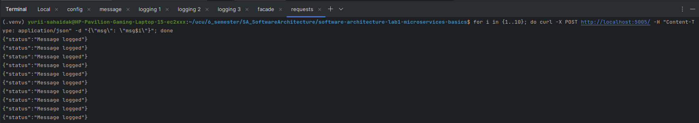
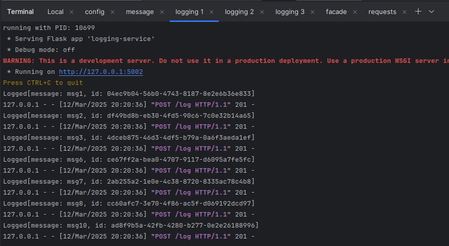
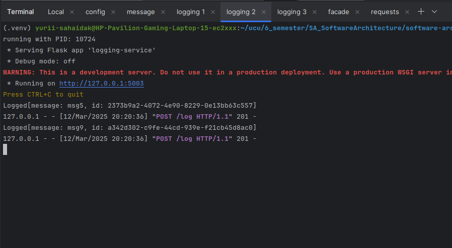
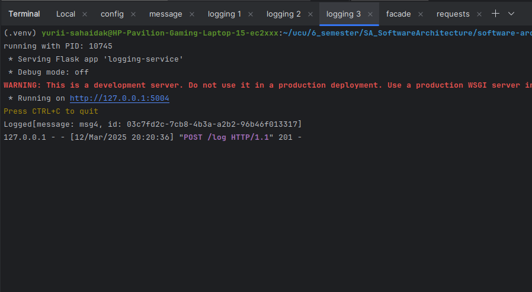
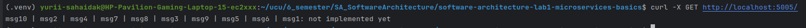
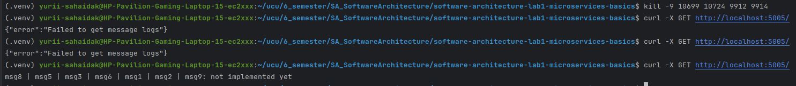
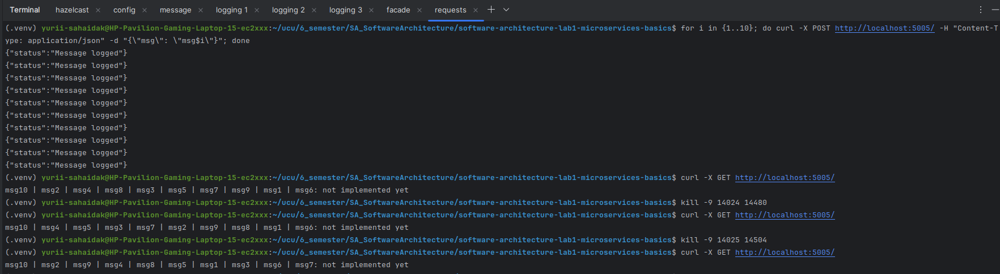

# Lab1: Microservices Basics

## Task:
The architecture consists of three microservices: 
- facade-service - accepts POST/GET requests from the client 
- logging-service - stores on hazelcast nodes all the messages it receives and can return them 
- messages-service - while acting as a stub, it returns a static message when addressed

## Usage:
### Python:
Every python script has -h option to get arguments. Run 
```bash
python3 ./python/<script>.py -h
``` 
to get parameters. Every script
except `logging-service.py` can run without arguments on default ports. Also `logging-service.py` will not show output 
if hazelcast nodes are not running.

### Bash:
The `control.sh` script can be used to run all services and hazelcast with one command. But logs will be at the same 
terminal.
Use 
```bash
./control.sh -h
```
To get proper arguments


## Deployment
To start all services and hazelcast nodes the following commands were run in different terminals

| terminal  | command                                                               |
|-----------|-----------------------------------------------------------------------|
| hazelcast | `./control -hs`                                                       |
| config    | `python3 ./python/config-server.py -p 5000 -m 5001 -l 5002 5003 5004` |
| message   | `python3 ./python/messages-service.py -p 5001`                        |
| logging1  | `python3 ./python/logging-service.py -i -p 5002`                      |
| logging2  | `python3 ./python/logging-service.py -i -p 5003`                      |
| logging3  | `python3 ./python/logging-service.py -i -p 5004`                      |
| facade    | `python3 ./python/facade-service.py -p 5005`                          |
The following structure was obtained

| service         | port      | request | endpoint                 | description                                        |
|-----------------|-----------|---------|--------------------------|----------------------------------------------------|
| hazelcast_nodes | 5701-5703 |         |                          |                                                    |
| config          | 5000      | GET     | /services/<service_name> | returns list of ports of <service_name>            |
| message         | 5001      | GET     | /message                 | returns static message                             |
| logging         | 5002-5004 | POST    | /log                     | logs message                                       |
|                 |           | GET     | /log                     | returns message logs                               |
| facade          | 5005      | GET     | /                        | returns messages and message from messages-service |      
|                 |           | POST    | /                        | creates message                                    |       

## Task
To push 10 messages, the following command was used
```bash
for i in {1..10}; do curl -X POST http://localhost:5005/ -H "Content-Type: application/json" -d "{\"msg\": \"msg$i\"}"; done
```

The following distribution of requests was obtained

| logging1                 | logging2                 | logging3                 |
|--------------------------|--------------------------|--------------------------|
|  |  |  |
| 1, 2, 3, 6, 7, 8, 10     | 5, 9                     | 4                        |

To read the results the following request was sent
```bash
curl -X GET http://localhost:5005/
```
The following result of shuffled but complete list of messages was obtained


After disabling 2 logging-services (PIDs 10699, 10724) and hazelcast nodes (PIDs 9912, 9914) some data was lost due to 
the same principles as in [lab2](https://github.com/SahaidakYurii/software-architecture-lab2-hazelcast). 

To avoid such 
behavior more replications can be setup in `config.xml`. For example 2.
```xml
<map name="default">
    <backup-count>2</backup-count>
</map>
```
The errors shown in cmd are because the logging-service which is called after GET request is chosen by random so it 
took a few requests to choose working one.

If killing logging-services and nodes one by one, no data loss is observed.


## Additional task
The config-server.py was created. It takes ports of all services in arguments and returns them when proper requests are 
sent. The requests schema is above