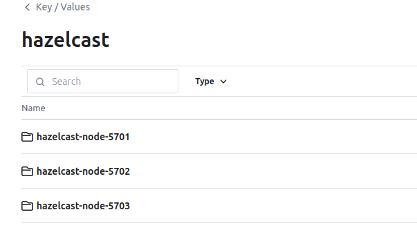
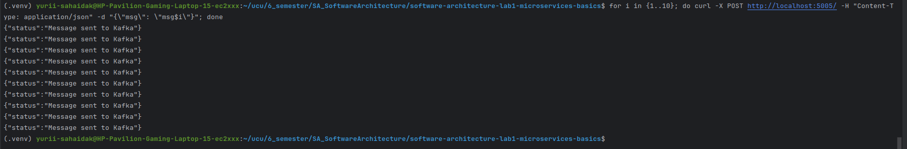
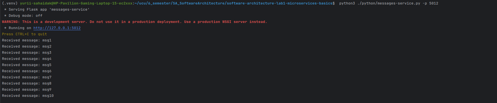
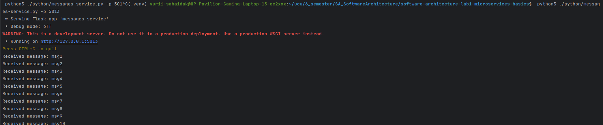
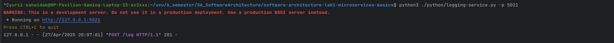
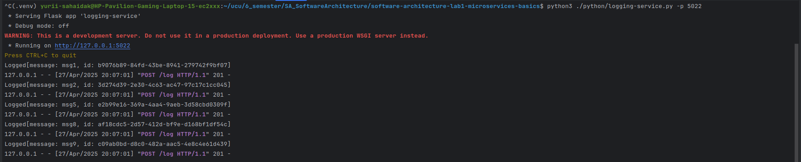
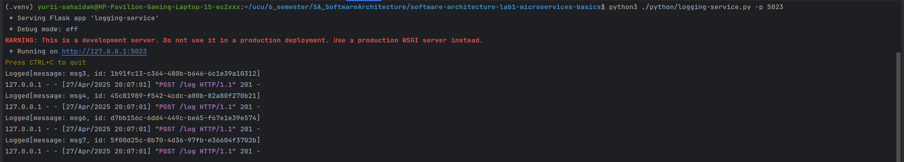

# Lab5: Consul

## Usage:
### Python services:
Every python script has -h option to get arguments. Run 
```bash
python3 ./python/<script>.py -h
``` 
to get parameters. Every script
except `logging-service.py` and `messages-service.py` can run without arguments on default ports. Also `logging-service.py` will not show output 
if hazelcast nodes are not running.

### Kafka and Consul:
Use the `docker-compose.yml` 
```bash
sudo systemctl enable docker
sudo systemctl start docker
```

```bash
sudo docker-compose up -d
```

To stop
```CommandLine
sudo docker-compose down
```

### Hazelcast:
The `control.sh` is used to start and register hazelcast in consul.
Use 
```bash
./control.sh -hs
```
To start hazelcast and
```bash
./control.sh -hk
```
To kill hazelcast nodes

## Deployment
To start all services and hazelcast nodes the following commands were run in different terminals

| terminal       | command                                        |
|----------------|------------------------------------------------|
| kafka & consul | `docker-compose up -d`                         |
| hazelcast      | `./control -hs`                                |
| message_i      | `python3 ./python/messages-service.py -p 501i` |
| logging_i      | `python3 ./python/logging-service.py -p 502i`  |
| facade         | `python3 ./python/facade-service.py`           |
The following structure was obtained

| service         | port      | request | endpoint | description                                        |
|-----------------|-----------|---------|----------|----------------------------------------------------|
| hazelcast_nodes | 5701-5703 |         |          |                                                    |
| kafka_brokers   | 9092-9094 |         |          |                                                    |
| consul          | 8500      |         |          |                                                    |
| message         | 5011-5012 | GET     | /message | returns static message                             |
| logging         | 5021-5023 | POST    | /log     | logs message                                       |
|                 |           | GET     | /log     | returns message logs                               |
| facade          | 5000      | GET     | /        | returns messages and message from messages-service |      
|                 |           | POST    | /        | creates message                                    |       


## Task
After startup, all services were added to Consul

The Hazelcast nodes information was stored in key/value field


After this 10 messages were sent from another terminal
```bash
for i in {1..10}; do curl -X POST http://localhost:5000/ -H "Content-Type: application/json" -d "{\"msg\": \"msg$i\"}"; done
```


The messages succesfully reached all message-services and logs were distributed among the logging-services
- The messaging services:



- The logging services:



- The GET request returned proper list of messages and logs
