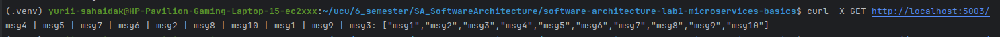

# Lab4: Kafka messages queue

## Usage:
### Python:
Every python script has -h option to get arguments. Run 
```bash
python3 ./python/<script>.py -h
``` 
to get parameters. Every script
except `logging-service.py` and `messages-service.py` can run without arguments on default ports. Also `logging-service.py` will not show output 
if hazelcast nodes are not running.

### Kafka:
Use the `docker-compose.yml` 
```bash
sudo systemctl enable docker
sudo systemctl start docker
```

```bash
sudo docker-compose up -d
```

To stop
```CommandLine
sudo docker-compose down
```

### Bash:
The `control.sh` script can be used to run all services and hazelcast with one command. But logs will be at the same 
terminal.
Use 
```bash
./control.sh -h
```
To get proper arguments


## Deployment
To start all services and hazelcast nodes the following commands were run in different terminals

| terminal  | command                                          |
|-----------|--------------------------------------------------|
| hazelcast | `./control -hs`                                  |
| config    | `python3 ./python/config-server.py -p 5000`      |
| message_i | `python3 ./python/messages-service.py -p 501i`   |
| logging_i | `python3 ./python/logging-service.py -i -p 502i` |
| facade    | `python3 ./python/facade-service.py -p 5003`     |
| kafka     | `docker-compose up -d`                           |
The following structure was obtained

| service         | port      | request | endpoint                 | description                                        |
|-----------------|-----------|---------|--------------------------|----------------------------------------------------|
| hazelcast_nodes | 5701-5703 |         |                          |                                                    |
| kafka_brokers   | 9092-9094 |         |                          |                                                    |
| config          | 5000      | GET     | /services/<service_name> | returns list of ports of <service_name>            |
| message         | 5011-5012 | GET     | /message                 | returns static message                             |
| logging         | 5021-5023 | POST    | /log                     | logs message                                       |
|                 |           | GET     | /log                     | returns message logs                               |
| facade          | 5003      | GET     | /                        | returns messages and message from messages-service |      
|                 |           | POST    | /                        | creates message                                    |       


## Task
Send 10 tasks to Kafka, when messaging services are down. Stop one kafka broker and than start messages services. 
Observe if any data was lost

To avoid data loss, replications on kafka server were set up by the following command
```bash
sudo docker exec -it <any-broker-container-id> kafka-topics \
  --create \
  --bootstrap-server kafka1:29092 \
  --replication-factor 2 \
  --partitions 1 \
  --topic messages
```

To check replications description the following one was used
```bash
sudo docker exec -it <any-broker-container-id> kafka-topics --describe \
  --bootstrap-server kafka1:29092 \
  --topic messages
```

After this 10 messages were sent from another terminal
```bash
for i in {1..10}; do curl -X POST http://localhost:5003/ -H "Content-Type: application/json" -d "{\"msg\": \"msg$i\"}"; done
```

From the description a leader of the group was identified and stopped
```commandline
docker stop <leader-id>
```
To start messaging services simultaneously, `messaging_start.sh` was used.

When the messaging services were started, all messages reached each of them




## Additional task
Used Kafka